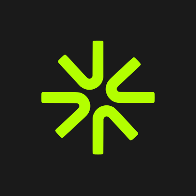

<p align="center"></p>

# Adrails MCP server

Remote MCP server for [Adrails](https://adrails.ai), the AI workspace for paid media. Connect Claude, Claude Code, ChatGPT, Codex or any remote MCP client to your Meta Ads and Google Ads accounts, your store and your analytics. Agents read your accounts and business data, build campaigns and prepare budget, status and launch changes, each with a link to its exact before and after.

This repository holds the listing metadata. The server itself is hosted by Adrails: there is nothing to install or run.

| | |
| --- | --- |
| Server URL | `https://adrails.ai/api/mcp` |
| Transport | Streamable HTTP |
| Authentication | OAuth 2.1 with PKCE and dynamic client registration |
| Official MCP Registry | `ai.adrails/adrails` |
| Documentation | [adrails.ai/docs/mcp](https://adrails.ai/docs/mcp) |

## Connect

You need an Adrails account. Every client uses the same URL; the client registers itself and you sign in to Adrails, then choose the workspace and the permissions on the consent screen.

**Claude** (claude.ai and desktop): Settings, Connectors, Add custom connector. Name it `Adrails`, paste `https://adrails.ai/api/mcp`, leave the OAuth client ID and secret empty, then connect.

**Claude Code**

```sh
claude mcp add --transport http adrails https://adrails.ai/api/mcp
```

Then run `/mcp`, select `adrails` and authenticate.

**ChatGPT**: turn on Developer mode in Settings (it depends on your plan and workspace policy), open Plugins and add a custom MCP server named `Adrails` with the URL above and OAuth authentication.

**Codex**

```sh
codex mcp add adrails --url https://adrails.ai/api/mcp
codex mcp login adrails
```

Full steps, including other clients: [Connect an AI client](https://adrails.ai/docs/mcp/connect).

## What it can do

63 tools, filtered by the permissions you grant and your role in the workspace:

- **Performance and analysis**: period and daily performance, metric comparisons, diagnosis, portfolio and business reviews across Meta and Google Ads, with store revenue next to ad metrics.
- **Campaigns**: campaign structure, drafts, templates, media, audience and keyword research (including Google Keyword Planner volumes).
- **Changes**: budget, status and campaign launches are prepared with a link to the exact before and after, applied once confirmed.
- **Business data**: Shopify, Klaviyo, Stripe, Triple Whale and PostHog connections, orders, customers and revenue.
- **Workspace**: automations, Knowledge, channels and job status.

Every tool, its inputs and its access level: [MCP tools reference](https://adrails.ai/docs/mcp/tools).

## Try

- *Which Meta and Google Ads campaigns wasted the most spend last week, and why?*
- *Compare blended ROAS this month with last month, using Shopify revenue.*
- *Prepare a 20% budget increase on my best campaign.* Nothing changes until you approve the link it returns.

## Security

A tool call runs no Adrails AI model, so it uses no agent credit (except an automation with an agent step), and it never writes to an ad account by itself: a change to Meta or Google Ads needs your explicit approval, signed in to Adrails, before the proposal expires. Connections can be revoked at any time from the MCP page in Adrails. Details: [MCP security](https://adrails.ai/docs/mcp/security).

## Support

support@adrails.ai · [adrails.ai](https://adrails.ai) · Built by TBSS Labs, LLC. Not affiliated with Meta Platforms, Inc. or Google LLC.
